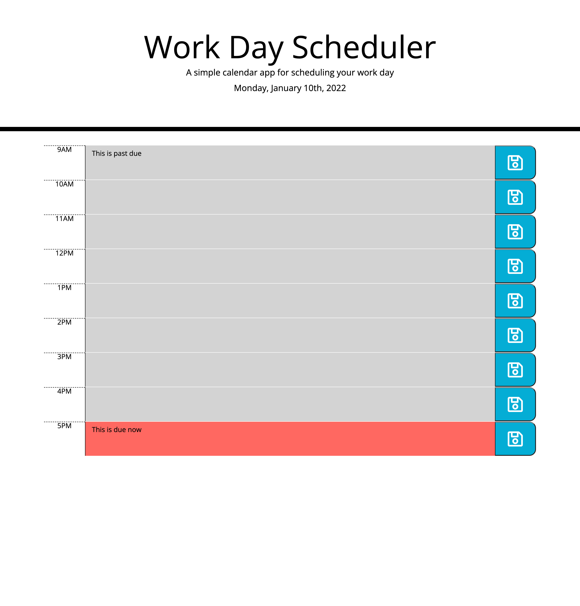

# Work Day Scheduler Starter Code

## Purpose
Develop a web based day planner app that will display blocks for standard business hours. The hours will be color coded to indicate if the timme as passed, is present or upcoming. 

## Built With
* HTML
* CSS 
* JavaScript

## Website
https://omcewan.github.io/omcewan-workday-schedule/

## Screenshots

